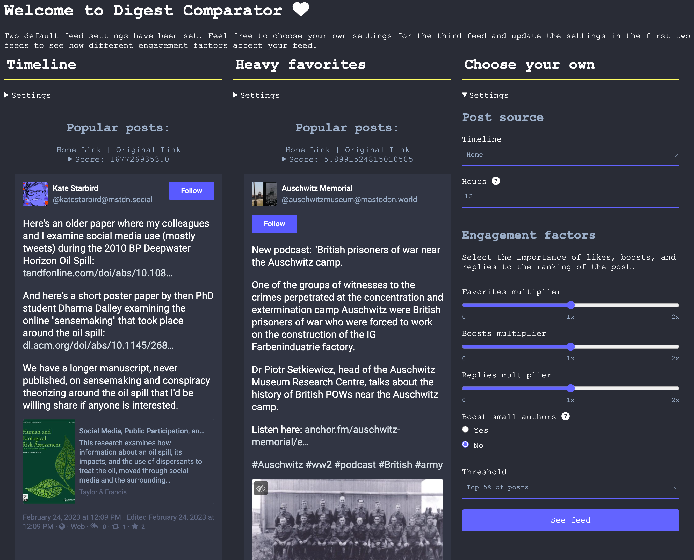

# Mastodon Digest Comparator

This is a fork of [Mastadon Digest](https://github.com/hodgesmr/mastodon_digest) by [@MattHodges](https://mastodon.social/@MattHodges).

It includes a simple Python/Flask server whose homepage allows you to compare 3 digests created from your timeline with
different scoring configurations. By default it loads and displays a pure time-based digest alongside one that is
configured to favor favorites, include boosts, and not include replies in the score. The third column feed is not
loaded automatically and displays the settings for you to adjust.

For each post score at the top and expand it to see the components of the score and how it was calculated.

Like the [Mastadon Digest](https://github.com/hodgesmr/mastodon_digest) project, each digest includes posts from users
you follow and boosts from your followers. And each list is constructed by respecting your server-side content filters,
identifying content you haven't interacted with, and excludes posts from users who include `#nobot` or `#noindex` in
their bio.



## Run
Currently you can only run the server locally. Before you do so, set up your environment:

Copy [.env.example](./.env.example) to `.env` (which is ignored by git) and fill in the relevant environment variables:

```sh
cp .env.example .env
```

 - `MASTODON_TOKEN` : This is your access token. You can generate one on your home instance under Preferences > Development. Your token only needs `read` permissions.
 - `MASTODON_BASE_URL` : This is the protocol-aware URL of your Mastodon home instance. For example, if you are `@Gargron@mastodon.social`, then you would set `https://mastodon.social`.

### Local

Mastodon Digest Comparator has been tested to work on Python 3.9 and above.

Run the following (optionally within a virtualenv):

```sh
pip install -r requirements.txt
flask --app server/application run
```

The server will be available at [http://127.0.0.1:5000](http://127.0.0.1:5000) by default.

## TODOs

There are so many! Top of mind:
 - Invest more in the available settings:
   - Choose hashtags that don't participate in engagement ranking (rank based on "quality"??). E.g. politics- or
     health-related hashtags might benefit from not participating in engagement ranking to reduce misinfo.
   - Create a score for "diverse approval" (requires definition of what that means) so that a
     ["bridging"](https://bridging.systems/) digest might be created.
 - Move away from iframed feed (See [this fork of Mastodon Digest](https://github.com/mauforonda/mastodon_digest)).
   - Move away from JINJA + vanilla JS towards something like React for easier frontend development and ability
     to create more interesting settings widgets.
 - Create a way to share your config (parameterized URL that would set the third column).
 - Better Mastodon auth flow (something OAuth-y)
 - Dockerize the server.
 - Deploy the server.
 - Cache the digest for N mins?
 - Ability to add/remove columns for comparison.
 - Usable mobile view (swipe left/right to compare post-by-post across feeds?)
